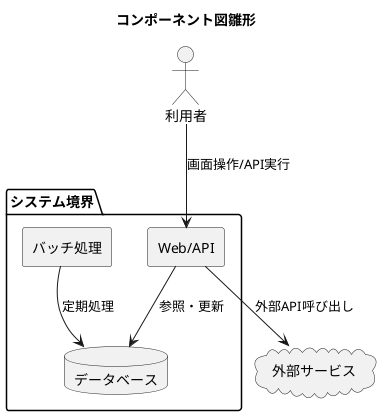
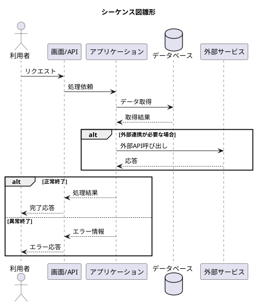
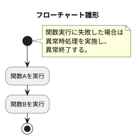

# PlantUML雛形

## コンポーネント

```plantuml
@startuml

title コンポーネント図雛形

skinparam componentStyle rectangle

actor "利用者" as User

package "システム境界" {
  [Web/API] as App
  [バッチ処理] as Batch
  database "データベース" as DB
}

cloud "外部サービス" as External

User --> App : 画面操作/API実行
App --> DB : 参照・更新
App --> External : 外部API呼び出し
Batch --> DB : 定期処理

@enduml
```

## シーケンス

```plantuml
@startuml

title シーケンス図雛形

actor "利用者" as User
participant "画面/API" as Api
participant "アプリケーション" as App
database "データベース" as DB
participant "外部サービス" as External

User -> Api : リクエスト
Api -> App : 処理依頼
App -> DB : データ取得
DB --> App : 取得結果

alt 外部連携が必要な場合
  App -> External : 外部API呼び出し
  External --> App : 応答
end

alt 正常終了
  App --> Api : 処理結果
  Api --> User : 完了応答
else 異常終了
  App --> Api : エラー情報
  Api --> User : エラー応答
end

@enduml
```

## フローチャート

```plantuml
@startuml

title フローチャート雛形

start

note right
  関数実行に失敗した場合は
  異常時処理を実施し、
  異常終了する。
end note

:関数Aを実行;
:関数Bを実行;

stop

@enduml
```
