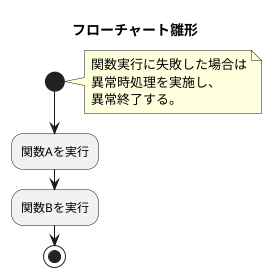

# 処理フロー雛形

## 処理フロー

1. 関数Aを実行する。
2. 関数Bを実行する。
3. 正常終了する。

## 共通ルール

関数の実行に失敗した場合は、共通の異常時処理を実施し、異常終了する。

## テストケース

| No. | テスト観点 | テスト手順 | 期待結果 |
| --- | --- | --- | --- |
| TC-001 | 正常系 | 1. 【デフォルト設定】を実施する 2. 本処理フローを実行する | ・関数Aが実行されること ・関数Bが実行されること ・正常終了すること |
| TC-002 | 関数A失敗時の異常系 | 1. 【関数A失敗設定】を実施する 2. 本処理フローを実行する | ・関数Bが実行されないこと ・共通の異常時処理が実行されること ・異常終了すること |
| TC-003 | 関数B失敗時の異常系 | 1. 【関数B失敗設定】を実施する 2. 本処理フローを実行する | ・関数Aが実行されること ・関数Bが実行されること ・共通の異常時処理が実行されること ・異常終了すること |

## フローチャート（PlantUML）

