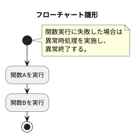

# 処理フロー雛形

## 処理フロー

1. 関数Aを実行する。
2. 関数Bを実行する。
3. 正常終了する。

## 共通ルール

関数の実行に失敗した場合は、共通の異常時処理を実施し、異常終了する。

## フローチャート（PlantUML）

```plantuml
@startuml
title フローチャート雛形

start

note right
  関数実行に失敗した場合は
  異常時処理を実施し、
  異常終了する。
end note

:関数Aを実行;
:関数Bを実行;

stop
@enduml
```
